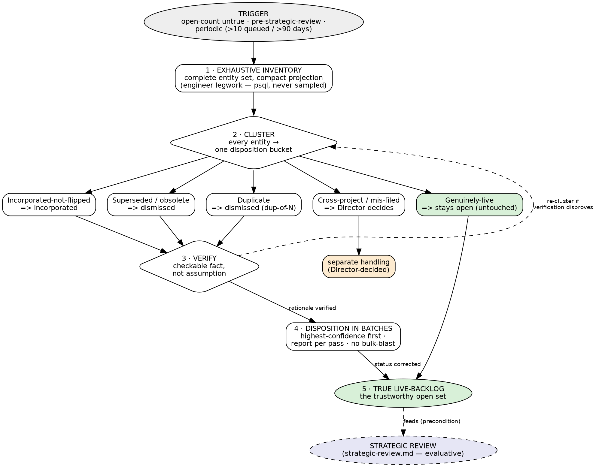

# Ledger Reconciliation — Methodology

**Status:** v1.1 (2026-05-22). Treat as engineered component — version, critique, evolve.
v1.1 folds five refinements surfaced by v1.0's own first run — see §Provenance.
**Tier:** 1 (methodology surface; peer to `strategic-review.md`).
**Scope:** reusable process for truing-up an entity ledger (Idea / Bug / Mission / Thread)
so its live state reflects reality.
**Companion:** `docs/methodology/strategic-review.md` — the *evaluative* counterpart.
Reconciliation is factual; strategic review is evaluative. See §Relationship.

---

## Purpose

A **ledger reconciliation** is a deliberate, exhaustive pass over an entity ledger that
corrects the status of every stale entry — so the `open` / `active` count is *true*. It
produces a clean ledger and an honest live-backlog. It does **not** evaluate, prioritise,
or rank — that is a strategic review.

The failure it addresses is **status rot**. Entities are created `open` / `active`; their
real disposition happens in the world — the mission shipped, the substrate was deleted, the
idea became a mission — but the status field is never updated. Over months the `open` count
drifts from reality: a "61-open-bug" ledger whose real live-defect count is ~16. A rotted
ledger silently corrupts every downstream judgement that reads it — triage, prioritisation,
strategic review, Director situational-awareness. Reconciliation is the periodic correction.

## When to use

- The `open` / `active` count of a ledger no longer plausibly reflects reality.
- **Before a strategic review** — a strategic review of a rotted backlog evaluates noise.
  Reconcile first (precondition; see §Relationship).
- A substrate / architecture change has deleted or retired surfaces older entities depend
  on — those entities are now obsolete but still sit `open`.
- Periodically — the `strategic-review.md` backlog-rot trigger (>10 queued / >90 days)
  applies equally as a reconciliation trigger.

## When NOT to use

- **As a substitute for a strategic review.** Reconciliation corrects *status*; it does not
  assess *value*. A genuinely-live idea stays `open` whether it is brilliant or marginal —
  reconciliation has no opinion on its merit.
- Mid-mission, for entities the active mission owns.
- On another project's entities (see Anti-patterns).

## Roles

| Role | Responsibility |
|---|---|
| **Director** | Ratifies the approach + the disposition cadence. Decides cross-project / ambiguous-ownership entities. Gate-point: the reconciliation plan, and the per-part / per-pass report. |
| **Engineer** | Inventory legwork — the exhaustive compact projection of the ledger. **Live-state / code verification** — is the substrate actually deleted? does the running system still use this surface? |
| **Architect** | Clustering by disposition-class. **Provenance verification** — reading the ledger's own records (a completed mission naming its source) needs no code, only the ledger. Per-entity disposition with verified rationale. Drives the pass; authors the reconciliation report. |

## The process — five steps

The process at a glance — Graphviz DOT (`dot -Tsvg ledger-reconciliation.dot`):

### 1 · Exhaustive inventory

Pull the **complete** entity set — not a sample. Reconciliation is exhaustive by
definition; a sampled reconciliation leaves rot and the `open` count stays untrue. Compact
projection only — id, status, age, tags, title/summary, and whatever field carries the
disposition signal — never full bodies. **Confirm the signal-field is actually populated
before relying on it.** A disposition-field can be structurally empty: the Idea ledger's
`missionId` is set on 0 of 224 entities — idea→mission lineage lives in tags and in the
mission entities, not the field. A field that looks authoritative but is never written
yields a false "nothing stale here" reading. Engineer-role legwork; a direct substrate
query (psql) beats paginated MCP tools wherever a tool truncates — and where psql is
unreachable, exhaustive paginated MCP retrieval is the valid fallback.

### 2 · Cluster by disposition-class

Sort **every** entity into exactly one disposition bucket. For the Idea ledger:

| Bucket | Signal | Disposition |
|---|---|---|
| **Incorporated-not-flipped** | the entity shipped as a mission; status never updated — found by terminal-ledger cross-ref (§3) | → `incorporated` |
| **Superseded / obsolete** | overtaken by later work, or its substrate was deleted/retired | → `dismissed` |
| **Duplicate** | the same idea filed twice | → `dismissed` (dup-of-N); keep the canonical one |
| **Cross-project / mis-filed** | belongs to a different project's ledger | → separate handling; Director decides |
| **Genuinely-live** | real, current, un-superseded | → stays `open` — untouched |

Bucket assignment runs as a single pass over the §1 projection: for each entity read its
disposition-signal, map it to the one bucket whose Signal it matches, and the Disposition
column follows from the bucket. Apply the mapping uniformly across every entity in one sweep
— do not weigh an entity's *worth* while clustering (that is strategic-review's evaluative
job, §Boundary below).

The same shape applies to any entity ledger — only the status vocabulary changes:
Bug ledger → resolved-not-flipped `resolved`, obsolete/duplicate `wontfix`, live `open`;
Mission ledger → shipped `completed`, dropped/moot `abandoned`;
Thread ledger → terminal-but-unclosed `closed` / force-closed.

### 3 · Verify before disposition

Every non-`keep` disposition carries a **verified rationale** — a checkable fact, not an
assumption. "The substrate is deleted" → name the deletion commit/PR. "The mission shipped"
→ confirm it merged. "It is a duplicate" → name the canonical entity. Verification that
needs a code or live-state check is engineer legwork. An unverified disposition is a guess,
and a guess that closes an entity can hide a live problem. Where a disposition rests on
inference rather than a hard trace, say so — and keep it trivially reversible.

**Reconcile from the terminal ledger backward.** To find an incorporated-not-flipped
entity, do not scan the open ledger for entries that *look* shipped — that is unbounded
heuristic guessing and it under-recalls (the part-3 pass's open-side `M-`-titled-idea scan
found 2 of 5). Walk the **terminal** ledger instead — the completed missions, the merged
PRs — and cross-ref each one's *stated source* against the open set. The terminal ledger
is bounded and authoritative: a completed mission names its own source. The open ledger is
the suspect set; the shipped ledger is ground truth — reconcile suspect-against-truth, not
suspect-against-hunch.

### 4 · Disposition in batches

Execute the status changes cluster by cluster, **highest-confidence first** (obsolete-
substrate before fixed-not-flipped before judgement-calls). Never bulk-blast the whole
ledger in a single action — batching keeps each disposition individually defensible.

A **batch is an execution unit, not a reporting unit.** Batch so each disposition stays
atomic and reviewable — but report to the Director **per part / per pass**, not per batch:
a five-entity batch is too thin a slice to be a gate-point.

Every pass produces a **reconciliation report** — a committed document at
`docs/reviews/<YYYY-MM-DD>-ledger-reconciliation-<scope>.md`. It records, per dispositioned
entity: id, bucket, disposition, and the verified rationale; plus the before → after count
and the residual live-backlog figure. The report is **mandatory for every `dismissed`
entity**: an `incorporated` disposition self-documents — the mission-link travels with the
entity and states the why — but a `dismissed` entity carries no such link, and without the
report its closure rationale evaporates entirely. (The report is a *document* today; a
first-class `Report` entity — idea-134, still open backlog — would be its natural home if
that ever lands.)

### 5 · The live-backlog is the output

What remains `open` / `active` after reconciliation is the *true* backlog. That clean set —
and only that — is a valid input to a strategic review, a prioritisation, or per-entity
triage. Reconciliation's deliverable is a ledger that can be trusted.

## Convergence

A reconciliation is complete when: every entity in the ledger has been clustered; every
non-`keep` disposition has executed with a recorded rationale; and the residual `open` /
`active` set is all genuinely-live. The reconciliation report (§4) records the
before → after count and the residual live-backlog figure.

## Relationship to `strategic-review.md`

Reconciliation and strategic review are **peers** — the two halves of backlog management:

| | Ledger Reconciliation | Strategic Review |
|---|---|---|
| Question | "Is each entry *true*?" | "Is each live idea *worth doing* — and *when*?" |
| Mode | factual / mechanical | evaluative / judgement |
| Output | a clean, trustworthy ledger | a prioritised mission set + anti-goals |
| Director role | ratifies the cadence | ratifies every phase |

Reconciliation **precedes and feeds** strategic review. `strategic-review.md` Phase 1
Cartography assumes a ledger worth mapping; run reconciliation first, and the strategic
review then evaluates the honest live-backlog reconciliation produced. Do **not** conflate
them — dispositioning an idea by its *value* (rather than its factual status) inside a
reconciliation is scope-bleed: that judgement belongs to the Director-gated strategic
review.

## Anti-patterns

- **Bulk-blast disposition** — closing a ledger in one mass action with no per-entity
  rationale. Each disposition must be individually defensible.
- **Reconciliation-as-strategic-review** — dispositioning by value rather than status. A
  marginal-but-live idea stays `open`; reconciliation holds no opinion on its merit.
- **Sampled inventory** — reconciling a subset. It leaves rot; the count stays untrue.
- **Disposition-on-assumption** — closing an entity because it "looks" stale without
  verifying the substrate / mission / duplicate state.
- **Cross-ledger disposition** — closing entities that belong to another project's ledger.
  Surface to the Director; never unilaterally disposition another project's backlog.
- **Rationale evaporation** — where the disposition tool has no reason field (`dismissed`
  ideas, `wontfix` bugs), the "why" is captured nowhere durable. The reconciliation report
  (§4) is the fix — and it is mandatory, not optional, for every no-reason-field
  disposition.

## Provenance

Authored 2026-05-22, codifying the Director-approved ledger-hygiene pass run that day. That
pass applied this process across four ledgers in sequence:
- **Part 1 — mechanical:** 5 stale-`active` missions reconciled (`completed` / `abandoned`),
  3 stale coordination threads force-closed, 1 idea relinked to its mission.
- **Part 2 — bug triage:** 61 open/investigating bugs clustered; 15 closed (obsolete
  `wontfix` ×6, fixed-not-flipped `resolved` ×8, duplicate ×1) — ledger 61 → 46. The
  canonical worked example: "61 open" reduced to ~16 genuinely-live, the remainder
  obsolete-substrate / fixed-not-flipped / duplicate / cross-project (24 missioncraft bugs,
  flagged for separate verification).
- **Part 3 — idea cartography:** the 224-open-idea backlog reconciled 224 → 213 — 6
  superseded/obsolete `dismissed`, 5 incorporated-not-flipped `incorporated`; ~190
  genuinely-live ideas left `open` as the strategic-review surface. Report:
  `docs/reviews/2026-05-22-ledger-reconciliation-ideas.md`.

## v1.1 — refinements from the v1.0 part-3 run

v1.0's first real exercise audited the methodology that authored it. Five folds:

1. **Reconcile from the terminal ledger backward** (§3) — v1.0 left the detection
   direction unspecified; the run improvised an open-side title-scan with ~40% recall.
2. **Disposition-fields can be structurally empty** (§1) — v1.0 cited `missionId` as the
   key Idea disposition-field; it is set on 0 of 224 entities.
3. **The reconciliation report** (§4) — v1.0 mandated a "pass artifact" but never located
   or shaped it.
4. **Verification splits architect / engineer** (§Roles) — provenance-reading and
   live-state/code checks are different work routed to different roles.
5. **Batch is an execution unit; report per part / pass** (§4) — v1.0's "report per batch"
   overpromised Director gate-points.
